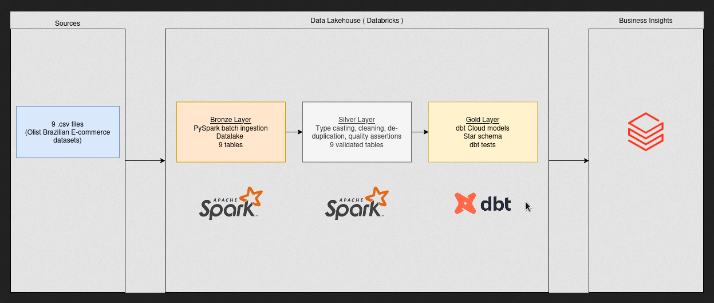
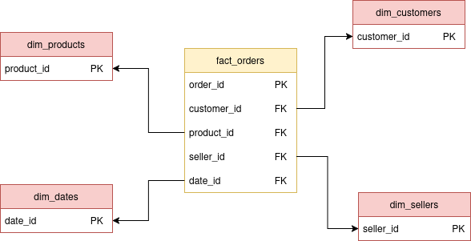
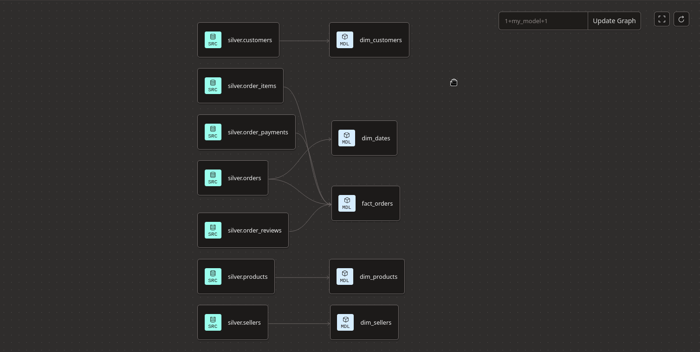
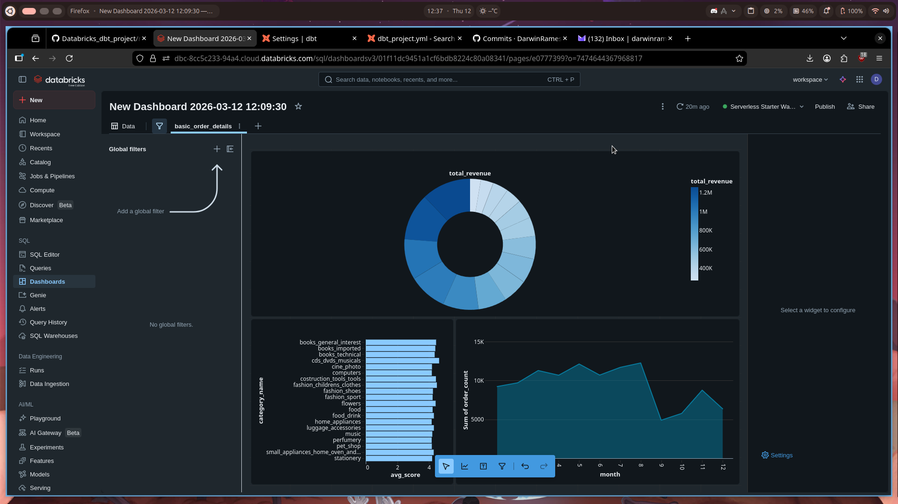

# Olist E-Commerce Lakehouse with Databricks + dbt

A scalable end-to-end pipeline writen following the medallion architecture (Bronze → Silver → Gold), powered by PySpark for ingestion and cleaning, and dbt Cloud for dimensional modelling. The dataset is the [Olist Brazilian E-Commerce dataset](https://www.kaggle.com/datasets/olistbr/brazilian-ecommerce) — 9 CSV files covering orders, customers, products, sellers, payments, reviews, and geolocation across ~100K transactions. The project is based on the Databricks platform. Automation, accesing of notebooks and compute is done with their servers on the

---

## Architecture



The pipeline is orchestrated and can be managed entirely on databricks. It uses pySpark for the cleaning and ingestion of data as well as setting schemas. The data is all batch ingested. Post-ingestion is automated and will execute each file into the bronze delta table. pySpark is used again in the silver layer to model data, add constraints, type cast variables and clean data. dbt Cloud is then utilised to properly model the data with ease and enforce idempotence.

---

## Tech Stack

| Tool | Purpose |
|---|---|
| Databricks (Free Edition) | Cloud lakehouse platform |
| PySpark | Bronze ingestion and Silver cleaning |
| Delta Lake | Table format across all three layers |
| Unity Catalog | Data governance and cataloguing |
| dbt Cloud | Gold layer modelling and automated testing |
| Databricks SQL | Dashboard and ad hoc querying |

---

## Project Structure

```
Databricks_dbt_project/
├── Datasets/                  # 9 Olist CSV source files
├── Notebooks/
│   ├── 01_bronze_autoloader.py   # Batch ingestion script
│   └── 02_silver_cleaning.py     # Cleaning and validation
├── models/
│   ├── silver/
│   │   └── sources.yml           # dbt source definitions
│   └── gold/
│       ├── schema.yml            # dbt tests
│       ├── fact_orders.sql
│       ├── dim_customers.sql
│       ├── dim_products.sql
│       ├── dim_sellers.sql
│       └── dim_dates.sql
├── macros/
├── dbt_project.yml
└── docs/
    ├── system_architecture.png
    └── star_schema.png
```
---

## Data Pipeline

### Bronze Layer

Raw CSV files are ingested using the pySpark command (`spark.read`) and written to tables under `workspace.bronze.*`. Each table gets three metadata columns appended at ingestion time: `_ingested_at`, `_source_file`, and `_layer`. Batch streaming was an intentional choice as we are dealing with static data with constant intervals. In this situation, consistency, safety and reliability is of up most importance.

**Row counts at ingestion:**

| Table | Rows |
|---|---|
| orders | 99,441 |
| order_items | 112,650 |
| order_payments | 103,886 |
| order_reviews | 104,162 |
| customers | 99,441 |
| products | 32,951 |
| sellers | 3,095 |
| geolocation | 1,000,163 |
| product_category_translation | 71 |

---

### Silver Layer

The Silver notebook handles type casting, cleaning, and validation. Notable fixes applied:

- `order_reviews`: malformed rows filtered using UUID regex, `review_score` cast from string to int, duplicate reviews deduplicated on `review_id`, re-ingested with multiline JSON options to handle embedded quotes
- `customers`, `sellers`, `geolocation`: `zip_code_prefix` columns cast from int to string to preserve leading zeros
- `order_items`: `order_item_id` cast from int to string
- `products`: left-joined with `product_category_translation` to add English category names

**Row counts after cleaning:**

| Table | Rows |
|---|---|
| orders | 99,441 |
| order_items | 112,650 |
| order_payments | 103,886 |
| order_reviews | 98,410 |
| customers | 99,441 |
| products | 32,951 |
| sellers | 3,095 |
| geolocation | 1,000,163 |
| product_category_translation | 71 |

---

### Gold Layer

The gold layer was built with dbt Cloud due to the fact that it is an industry standard tool, enforced idempotency and allows for a very easy verification of data integrity through constraint checks. The final verified and modelled data was stored under `workspace.gold.*`.



**Models:**

- `fact_orders` — central fact table joining orders, order items, payments, and reviews
- `dim_customers` — customer geography and unique IDs
- `dim_products` — product categories and dimensions
- `dim_sellers` — seller geography
- `dim_dates` — date breakdown from order purchase timestamps

**dbt tests run on every model** — `unique` and `not_null` constraints on all primary keys. All 9 tests pass.

---

## dbt Lineage



---

## Dashboard

I decided to use the inbuilt Databricks dashboard instead of another different tool like Metabase or PowerBI because it is natively implemented to the data platform my project already runs on.

- Total revenue by Brazilian state
- Revenue breakdown by product category (top 15)
- Order volume over time (monthly trend)



---

## Data Quality

Quality is enforced at two layers:

- **Silver**: Python `assert_unique` will ensure malformed primary_keys are caught at write times.
- **Gold**: dbt `unique` and `not_null` tests on all dimension primary keys and the fact table order ID

---

## How to Run

1. Clone the repo and upload the Olist CSVs to `Datasets/` in your Databricks workspace
2. Create a Unity Catalog-enabled Databricks workspace with a `workspace` catalog
3. Run `Notebooks/01_bronze_autoloader.py` to populate the Bronze layer
4. Run `Notebooks/02_silver_cleaning.py` to build the Silver layer
5. Connect dbt Cloud to the repo and configure a Databricks SQL Warehouse connection pointing to the `workspace` catalog
6. Run `dbt run` to build the Gold layer
7. Run `dbt test` to validate data quality

---

## Possible Extensions

- Apache Airflow DAGs to orchestrate the full Bronze → Silver → Gold pipeline on a schedule
- Real-time streaming ingestion layer using Databricks Auto Loader with a live API source
- ML layer on top of Gold for delivery time prediction or customer segmentation
- Great Expectations integration for richer data quality reporting
